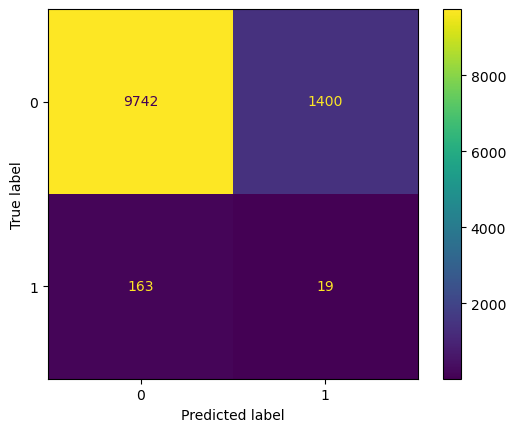

# Predicting Running-Related Injuries with Machine Learning

This project aims to predict running-related injuries using machine learning techniques based on data from a large-scale athletic study. The primary dataset is sourced from the following publication:

**Dataset Source**:  
[Running Injury Dataset - DataverseNL](https://dataverse.nl/dataset.xhtml?persistentId=doi:10.34894/UWU9PV)

## 📊 Dataset Overview

The dataset contains longitudinal data collected from runners and is available in two formats:
- **Daily-level data** (primary focus)
- **Weekly-level data**

The daily dataset provides more granular insights into training loads and injury risk, and thus serves as the primary focus of this study.

---

## 🧠 Models Developed

We evaluated four models on the daily dataset to predict whether a runner would sustain an injury. Below are the models and their performance metrics.

### 📊 Model Performance Comparison

| **Model**           | **Accuracy** | **Precision (Class 1)** | **Recall (Class 1)** | **F1-Score (Class 1)** | **AUC-ROC** |
|---------------------|--------------|--------------------------|----------------------|------------------------|-------------|
| Random Forest       | 0.86         | 0.01                     | 0.10                 | 0.02                   | 0.5438      |
| Simple Neural Net   | 0.92         | 0.03                     | 0.14                 | 0.05                   | 0.5481      |
| Ungrouped LSTM      | 0.94         | 0.03                     | 0.09                 | 0.04                   | 0.5411      |
| Grouped LSTM        | 0.96         | 0.14                     | 0.38                 | 0.20                   | 0.7097      |
| XGBoost (Original)  | *N/A*        | *N/A*                    | *N/A*                | *N/A*                  | **0.7254**  |

### 🔍 Correlation Matrices

### Random Forest & Simple Neural Net

<table>
  <tr>
    <td align="center"><strong>Random Forest</strong></td>
    <td align="center"><strong>Simple Neural Net</strong></td>
  </tr>
  <tr>
    <td></td>
    <td></td>
  </tr>
</table>

### Ungrouped LSTM & Grouped LSTM

<table>
  <tr>
    <td align="center"><strong>Ungrouped LSTM</strong></td>
    <td align="center"><strong>Grouped LSTM</strong></td>
  </tr>
  <tr>
    <td></td>
    <td></td>
  </tr>
</table>

